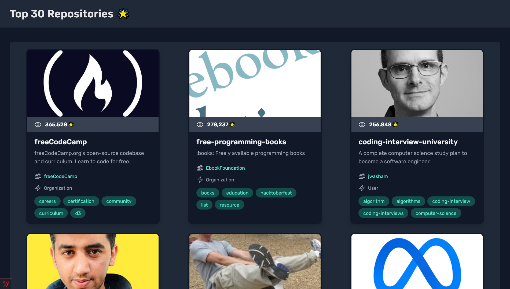

<!-- Preview Image -->



# Gittu — Top 30 Github Repositories

For this project, I utilized Laravel's HTTP Client to create a Github API endpoint that retrieves and stores the top 30 repositories. Additionally, I optimized the data using Cache to enhance its performance. I also ensured clean code by utilizing Blade components.

## Features

-   Auto Update Repositories Daily Using Task Scheduler
-   Custom Artisan Command To Update The Repositories
-   Super Simple With Modern Layout
-   Laravel Breeze Installed By Default

## Installation

Please check the [Laravel Official Documentation](https://laravel.com/docs/master/installation) installation guide for server requirements before you start.

First, clone this repo

```bash
git clone https://github.com/alnahian2003/gittu.git
```

Switch to the repo folder

```bash
cd gittu
```

Install all the dependencies using composer and npm

```bash
composer install
```

```bash
npm install
```

Copy the `.env.example` file and make the required configuration changes in the .env file

```bash
cp .env.example .env
```

Generate a new application key

```bash
php artisan key:generate
```

Run the database migrations (Set the database connection in .env before migrating)

```bash
php artisan migrate
```

Start the local development server

```bash
php artisan serve
```

**You can now access the server at http://localhost:8000.**

### TL;DR

All the command list

```bash
git clone https://github.com/alnahian2003/gittu.git
```

```bash
cd gittu
```

```bash
composer install
```

```bash
npm install
```

```bash
cp .env.example .env
```

```bash
php artisan key:generate
```

```bash
php artisan migrate
```

```bash
php artisan serve
```

## Tech Stack

**Client Side:** Blade, Breeze, TailwindCSS

**Server Side:** PHP, Laravel

## Note

You can clone and use this repo for reference and to practice more effectively. You don't even need to provide any backlink for that. Happy to help!

## Support

Don't miss out my latest [Laravel Tips and Tricks on Twitter](https://twitter.com/alnahian2003)
For support, [contact me](https://alnahian2003.github.io#contact) or pull an issue.

<!-- অত্যন্ত দুঃখিত যে, আজকের ভিডিওটা বেশ বড় হয়ে গেলো...
তবে আমার বিশ্বাস, বিগিনার কিংবা ইন্টারমিডিয়েট লারাভেল ডেভেলপারদের কাছে আজকের টপিক - প্র্যাক্টিক্যাল ক্যাশ (Cache) এবং HTTP Client অনেক নতুন চিন্তার দরজা খুলে দেবে!
অনেকসময় আপনার লারাভেল অ্যাপে এক্সটার্নাল এপিআই থেকে ডেটা আদান-প্রদানের প্রয়োজন হতে পারে। এক্ষেত্রে লারাভেল খুবই সুন্দর ভাবে Guzzle Http এর ওপরে HTTP ক্লায়েন্ট বানিয়ে দিয়েছে। সহজেই এখন সব ধরণের অ্যাকশন করা যাচ্ছে!
আবার রিসেন্টলি গ্রুপে দেখলাম লারাভেল সাইট স্লো, কীভাবে ইমপ্রুভ করবেন বলে জানতে চেয়েছেন। লারাভেল অ্যাপ অপ্টিমাইজেশনের অনেক গুলো ফ্যাক্টরের মাঝে ক্যাশ নিয়ে কারসাজি একটা বিরাট রোল প্লে করে। তবে পার্ফেক্ট ভাবে ক্যাশ ফিচার ইমপ্লিমেন্ট করাটাই একজন ডেভেলপার হিসেবে আসল গেম! পুরোই আপনার সিদ্ধান্ত, প্ল্যান আর অ্যানালাইসিসের ওপরে নির্ভর করবে ব্যাপারটা।
আপনাদের সাথে সাথে আমিও শিখেছি। তবে আবারও দুঃখিত, আমার হেডফোনের মাইক্রোফোনটা আগেরচেয়ে খুবই বাজে হয়ে যাওয়ায় ভয়েস ও সাউন্ড কোয়ালিটি আগেরচেয়ে অনেক ডাউন হয়ে গিয়েছে... 🙁
(কেউ প্রোফেশনাল স্টুডিও মাইক্রোফোন গিফট করলে আমি কিছু মনে করব না 😁🙈)
পুনশ্চঃ সময় নিয়ে নিশ্চিন্তে কোথাও বসে একবার ডকুমেন্টেশন পড়ে নিন, এরপরে ভিডিওটা দেখে নিজের মত করে নিজের কোনো প্রজেক্টে শেখা বিষয় গুলো ইমপ্লিমেন্ট করুন। আমার 'গিট্টু' প্রজেক্টের গিটহাব রিপোজিটরি লিংক আর অন্যান্য ডকুমেন্টেশন লিংক থাকবে প্রথম কমেন্টে। -->
